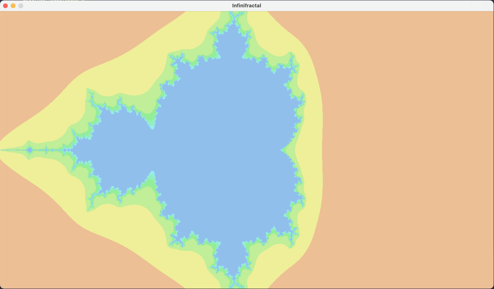

# infinifractal

A Mandlebrot set fractal viewer

#### Runtime

The original implementation is single threaded, naively rendering one pixel at a time. The draw time is around `5000ms`.

The current version parallelizes the process using a threadpool. Each horizontal line of pixels is handled by a separate thread.
With threading, the draw time is around `925ms`, indicating a 5.4x speedup over the single thread version.

### Installation

Depends on SDL2. Run `brew install sdl2`.

To install, run `make` and then the application can be started by running `./app`.