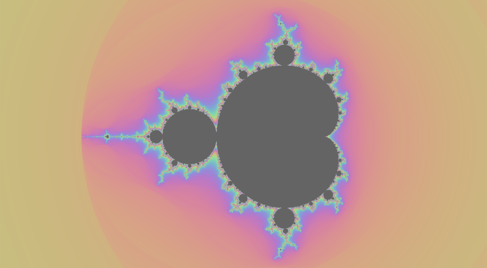

# infinifractal

A Mandlebrot set fractal viewer

#### Implementation

The graphics is handled by SDL2. On every rerender, we lock the pixel buffer, update all the pixels with the new colors, and then unlock it.

For the calculation of the iterations under the Mandlebrot scheme, we set the divergence limit to be 2.0 and count the iterations. The maximum
iterations we allow is 1000. However, integer iterations cause banding in the colors. Therefore, we use a formula as described in 
[this article](https://rubenvannieuwpoort.nl/posts/smooth-iteration-count-for-the-mandelbrot-set) that allows for fractional iteration estimates, 
since the number of iterations under the scheme is actually continuous.

Another bottleneck in this program is due to the rounding performed while converting from HSL to RGB, which will be worked on to reduce color banding.

#### Runtime

The original implementation is single threaded, naively rendering one pixel at a time. The draw time of a single frame is around `5000ms`.

The current version parallelizes the process using a threadpool implemented in `Threadpool.cpp`. Each horizontal line of pixels is handled by a separate thread.
With threading, the draw time of a frame is around `925ms`, indicating a 5.4x speedup over the single threaded version.

#### Limitations & Future Improvements

- Hardware acceleration like CUDA could potentially allow for performance improvements
- We might want to avoid manipulating pixels directly for performance
- We could consider using a Automatic Dwell Limit algorithm to improve framerate.

#### Installation

Depends on SDL2. Run `brew install sdl2`.

To install, run `make` and then the application can be started by running `./app`.